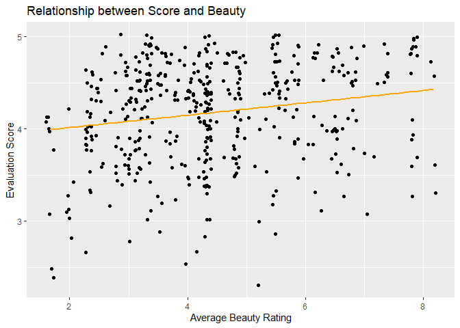

Lab 9 - Modeling professor attractiveness and course evaluations
================
Cat Seitz
02.28.2023

### Load packages and data

``` r
library(tidyverse) 
library(tidymodels)
library(openintro)
library(broom)
```

### Exercise 1

``` r
evals<-evals

ggplot(evals, aes(x=score))+
  geom_histogram(binwidth=0.1)
```

<!-- -->

The distribution is negatively skewed. Students seem to rate most
professors relatively highly. I would expect this for a few reasons: 1)
they are professors - typically tenured or tenure-track at a
university - so I would expect them to have some experience and be
decent, 2) the students are paying tuition to be there so they wouldn’t
necessarily want to admit that they’re not getting great instruction, 3)
these scores are the average across many students’ evaluations so it’s
unlikely to get a consensus bad review.

### Exercise 2

``` r
ggplot(evals, aes(x = bty_avg, y=score))+
  geom_point()+
  stat_smooth(method="lm", se=F)+
  #annotate("text", x=2.8, y=8, label=(paste0("slope==", coef(lm(evals$score~evals$bty_avg))[2])), parse=TRUE)+
  labs(title="Relationship between Score and Beauty", y="Evaluation Score", x="Average Beauty Rating")
```

    ## `geom_smooth()` using formula = 'y ~ x'

<!-- -->

Evaluation score and average beauty rating seem to be correlated; so
typically, higher beauty ratings also get higher evaluation scores.

### Exercise 3

``` r
ggplot(evals, aes(y = score, x=bty_avg))+
  geom_jitter()+
  stat_smooth(method="lm")+
  labs(title="Relationship between Score and Beauty", y="Evaluation Score", x="Average Beauty Rating")
```

    ## `geom_smooth()` using formula = 'y ~ x'

<!-- -->

Jitter “adds a small amount of random variation to the location of each
point.” This new plot handles overplotting, so now all of the data
points are pretty much in view.

### Exercise 4

We are trying to understand variations in evaluation score based on
beauty rating.

``` r
linear_reg() %>%
  set_engine("lm") %>%
  fit(score ~ bty_avg, data = evals) %>%
  tidy()
```

    ## # A tibble: 2 × 5
    ##   term        estimate std.error statistic   p.value
    ##   <chr>          <dbl>     <dbl>     <dbl>     <dbl>
    ## 1 (Intercept)   3.88      0.0761     51.0  1.56e-191
    ## 2 bty_avg       0.0666    0.0163      4.09 5.08e-  5

Model: (Evaluation Score) = 3.88 + 0.067(Beauty Rating)

This model was significant, so beauty ratings significantly predicted
evaluation scores of professors.

### Exercise 5

I had already plotted with the regression line before being asked to do
so, so here it is again, but in orange.

``` r
ggplot(evals, aes(y = score, x=bty_avg))+
  geom_jitter()+
  stat_smooth(method="lm", color= "orange", se=FALSE)+
  labs(title="Relationship between Score and Beauty", y="Evaluation Score", x="Average Beauty Rating")
```

    ## `geom_smooth()` using formula = 'y ~ x'

<!-- -->

### Exercise 6

The higher the average beauty ratings professors receive, the higher
evaluation scores they are given by students.

### Exercise 7

The intercept indicates the evaluation score a professor would receive
if their beauty rating was 0. In this context, this makes sense because
professors can still be evaluated if they are extremely unattractive.

### Exercise 8

``` r
summary(lm(score ~ bty_avg, data = evals))
```

    ## 
    ## Call:
    ## lm(formula = score ~ bty_avg, data = evals)
    ## 
    ## Residuals:
    ##     Min      1Q  Median      3Q     Max 
    ## -1.9246 -0.3690  0.1420  0.3977  0.9309 
    ## 
    ## Coefficients:
    ##             Estimate Std. Error t value Pr(>|t|)    
    ## (Intercept)  3.88034    0.07614   50.96  < 2e-16 ***
    ## bty_avg      0.06664    0.01629    4.09 5.08e-05 ***
    ## ---
    ## Signif. codes:  0 '***' 0.001 '**' 0.01 '*' 0.05 '.' 0.1 ' ' 1
    ## 
    ## Residual standard error: 0.5348 on 461 degrees of freedom
    ## Multiple R-squared:  0.03502,    Adjusted R-squared:  0.03293 
    ## F-statistic: 16.73 on 1 and 461 DF,  p-value: 5.083e-05

The adjusted R-squared is .033. This suggests that 3.3% of the variation
in evaluation scores is accounted for by beauty ratings, which may not
seem like a lot but it is more than we would like considering beauty
shouldn’t play a role in the how well a professor can teach.

### Exercise 9

Here, I just plotted the evaluation scores based on gender to see which
gender has higher scores on average.

``` r
ggplot(evals, aes(y = score, x=gender))+
  geom_point(alpha=.3)+
  stat_summary(aes(y=score, group=1), fun=mean, color="orange", geom="line", group=1)+
  labs(title="Relationship between Score and Gender", y="Evaluation Score", x="Gender")
```

<!-- -->

``` r
linear_reg() %>%
  set_engine("lm") %>%
  fit(score ~ gender, data = evals) %>%
  tidy()
```

    ## # A tibble: 2 × 5
    ##   term        estimate std.error statistic p.value
    ##   <chr>          <dbl>     <dbl>     <dbl>   <dbl>
    ## 1 (Intercept)    4.09     0.0387    106.   0      
    ## 2 gendermale     0.142    0.0508      2.78 0.00558

Model: (Evaluation Score)=4.09 + 0.14(gender)

The slope indicates that males typically have higher evaluation scores
by 0.14 points. The intercept is the average evaluation score of the
female professors.

### Exercise 10

These are the average evaluation scores for each gender.

Male: y=4.23 Female: y=4.09

### Exercise 11

``` r
linear_reg() %>%
  set_engine("lm") %>%
  fit(score ~ rank, data = evals) %>%
  tidy()
```

    ## # A tibble: 3 × 5
    ##   term             estimate std.error statistic   p.value
    ##   <chr>               <dbl>     <dbl>     <dbl>     <dbl>
    ## 1 (Intercept)         4.28     0.0537     79.9  1.02e-271
    ## 2 ranktenure track   -0.130    0.0748     -1.73 8.37e-  2
    ## 3 ranktenured        -0.145    0.0636     -2.28 2.28e-  2

Model: (Evaluation Score)= 4.28 - .13(tenure track professors) -
.15(tenured professors) \<- this seems off??

Teaching professors are expected, on average, to have an evaluation
score of 4.28. Tenure track professors are expected, on average, to have
scores .13 points less than teaching professors, and tenured professors
are expected, on average, to have scores .15 points less than teaching
professors.

### Exercise 12

``` r
evals<-evals %>%
  mutate(rank_relevel = 
           case_when(rank=="tenure track" ~"A",
                     rank=="tenured"~"B",
                     rank=="teaching"~"C"))
```

### Exercise 13

``` r
ggplot(evals, aes(y = score, x=rank))+
  geom_point(alpha=.3)+
  stat_summary(aes(y=score, group=1), fun=mean, color="orange", geom="line", group=1)+
  labs(title="Relationship between Score and Rank", y="Evaluation Score", x="Rank")
```

<!-- -->

``` r
linear_reg() %>%
  set_engine("lm") %>%
  fit(score ~ rank_relevel, data = evals) %>%
  tidy()
```

    ## # A tibble: 3 × 5
    ##   term          estimate std.error statistic   p.value
    ##   <chr>            <dbl>     <dbl>     <dbl>     <dbl>
    ## 1 (Intercept)     4.15      0.0521    79.7   2.58e-271
    ## 2 rank_relevelB  -0.0155    0.0623    -0.249 8.04e-  1
    ## 3 rank_relevelC   0.130     0.0748     1.73  8.37e-  2

``` r
summary(lm(score ~ rank_relevel, data=evals))
```

    ## 
    ## Call:
    ## lm(formula = score ~ rank_relevel, data = evals)
    ## 
    ## Residuals:
    ##     Min      1Q  Median      3Q     Max 
    ## -1.8546 -0.3391  0.1157  0.4305  0.8609 
    ## 
    ## Coefficients:
    ##               Estimate Std. Error t value Pr(>|t|)    
    ## (Intercept)    4.15463    0.05214  79.680   <2e-16 ***
    ## rank_relevelB -0.01550    0.06228  -0.249   0.8036    
    ## rank_relevelC  0.12968    0.07482   1.733   0.0837 .  
    ## ---
    ## Signif. codes:  0 '***' 0.001 '**' 0.01 '*' 0.05 '.' 0.1 ' ' 1
    ## 
    ## Residual standard error: 0.5419 on 460 degrees of freedom
    ## Multiple R-squared:  0.01163,    Adjusted R-squared:  0.007332 
    ## F-statistic: 2.706 on 2 and 460 DF,  p-value: 0.06786

Model: (Evaluation Score) = 4.15 - .015(tenured professors) +
.13(teaching professors)

Tenure track professors are expected, on average, to have an evaluation
score of 4.15. Tenured professors are expected, on average, to have
scores .015 points less than tenure track professors, and teaching
professors are expected, on average, to have scores .13 points greater
than tenure track professors.

The adjusted R2 is .007 and indicates that 0.7% of variation in
evaluation scores is predicted by professor rank.

### Exercise 14

``` r
evals<-evals %>%
  mutate(tenure_eligible = 
           case_when(rank=="tenure track" ~"yes",
                     rank=="tenured"~"yes",
                     rank=="teaching"~"no"))
```

### Exercise 15

``` r
linear_reg() %>%
  set_engine("lm") %>%
  fit(score ~ tenure_eligible, data = evals) %>%
  tidy()
```

    ## # A tibble: 2 × 5
    ##   term               estimate std.error statistic   p.value
    ##   <chr>                 <dbl>     <dbl>     <dbl>     <dbl>
    ## 1 (Intercept)           4.28     0.0536     79.9  2.72e-272
    ## 2 tenure_eligibleyes   -0.141    0.0607     -2.32 2.10e-  2

``` r
summary(lm(score ~ tenure_eligible, data=evals))
```

    ## 
    ## Call:
    ## lm(formula = score ~ tenure_eligible, data = evals)
    ## 
    ## Residuals:
    ##     Min      1Q  Median      3Q     Max 
    ## -1.8438 -0.3438  0.1157  0.4360  0.8562 
    ## 
    ## Coefficients:
    ##                    Estimate Std. Error t value Pr(>|t|)    
    ## (Intercept)          4.2843     0.0536  79.934   <2e-16 ***
    ## tenure_eligibleyes  -0.1406     0.0607  -2.315    0.021 *  
    ## ---
    ## Signif. codes:  0 '***' 0.001 '**' 0.01 '*' 0.05 '.' 0.1 ' ' 1
    ## 
    ## Residual standard error: 0.5413 on 461 degrees of freedom
    ## Multiple R-squared:  0.0115, Adjusted R-squared:  0.009352 
    ## F-statistic: 5.361 on 1 and 461 DF,  p-value: 0.02103

Model: (Evaluation Score) = 4.28 - .14(tenure-eligible professors)

Teaching professors are expected, on average, to have an evaluation
score of 4.28. Tenure-eligible professors are expected, on average, to
have scores .014 points less than teaching professors.

The adjusted R2 is .009 and indicates that 0.9% of variation in
evaluation scores is predicted by tenure eligibility.
